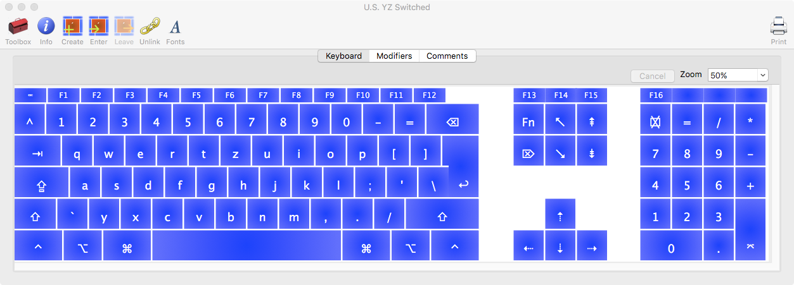
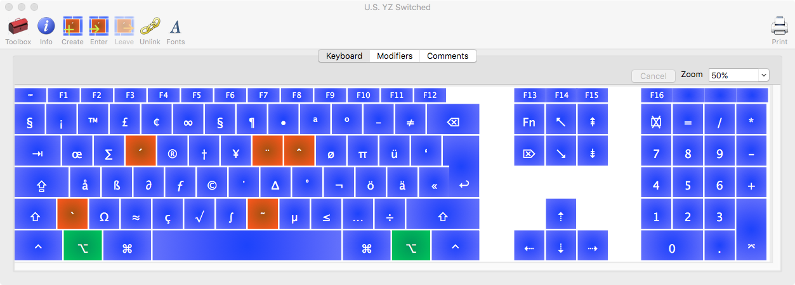
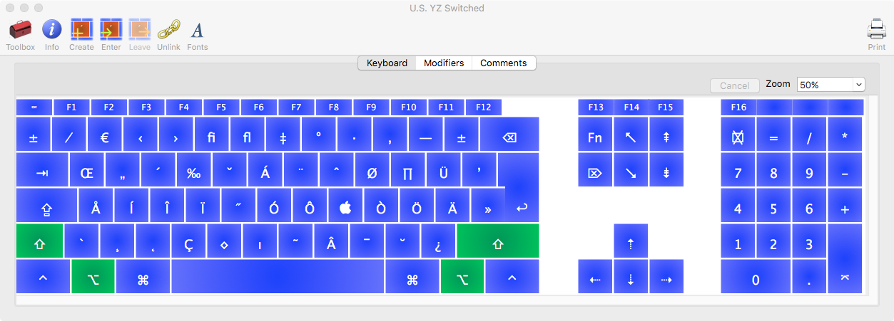

Florians Dotfiles
=================

Dotfiles for my setup using zsh, tmux and neovim

## Setup

### Installation

I clone my dotfiles using using [homesick]

```bash
gem install homesick
homesick clone https://github.com/floscr/Dotfiles
homesick symlink
```

## Shell Aliases & Functions

From time to time i will describe my custom functions and aliases here:    

### Functions

  + `t`
    Display nice tree structure in current directory.
    Uses [tree](http://mama.indstate.edu/users/ice/tree/)

  + `tgulp`
    Run gulp in a new split without leaving the current split.    
    This also closes all other splits!

* * *

### Custom German Programming keyboard

Since the US keyboard is much better when programming but I just can't shake some keys that are hardwired to my brain, I've created my own Frankenstein of a keyboard input for German and English typing.    

It's pretty much the US keyboard, except for a few changes:    

  1. <kbd>Y</kbd> & <kbd>Z</kbd> are switched    
  *Just can't shake that*
  2. <kbd>^</kbd> replaces <kbd>§</kbd>    
  *Who needs that symbol ever.*
  3. Umlaut are in the same position as in the German keyboard, but are triggered by pressing ⌥.    
  example: <kbd>ALT</kbd> + <kbd>'</kbd> = <kbd>ä</kbd>    
  example: <kbd>ALT</kbd> + <kbd>SHIFT</kbd> + <kbd>'</kbd> = <kbd>Ä</kbd>

Here a few screenshots:





I've modified the keyboard with [ukulele.app](http://scripts.sil.org/cms/scripts/page.php?site_id=nrsi&id=ukelele)

### Tmux with true color support

To get NeoVim & tmux working with true color support you have to do the following things:

1. **Download iTerm nightly:**    
   [iTerm nightly]

2. **Intall tmux with truecolor patch**    

   ```bash
   brew edit tmux
   ```

   Then, before `def install`, add this.

   ```ruby
     option "with-truecolor", "Build with truecolor patch enabled"
     patch do
       url "https://gist.githubusercontent.com/zchee/9f6f2ca17acf49e04088/raw/0c9bf0d84e69cb49b5e59950dd6dde6ca265f9a1/tmux-truecolor.diff"
       sha1 "8e91ab1c076899feba1340854e96594aafee55de"
     end if build.with? "truecolor"
   ```

   Now you can run `brew install tmux --with-truecolor` and get all the colors for iterm nightly.

[iTerm nightly]: https://iterm2.com/downloads/nightly/
[homesick]: https://github.com/technicalpickles/homesick
